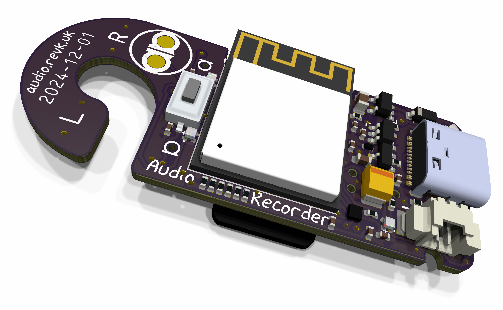
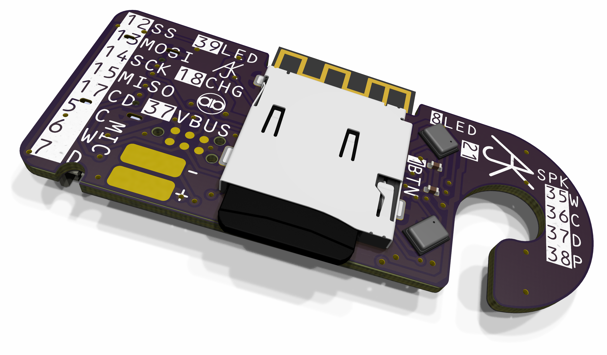

# Audio recorder board

The Audio record board provides a shirt mount Audio board.

Features

* LiPo battery handling and charging
* Mic, stereo TDK ICS 43434 24 bit
* Speaker (solder pads) 4Ω using MAX98357A
* SD card slot
* Button to start/stop recording, etc.